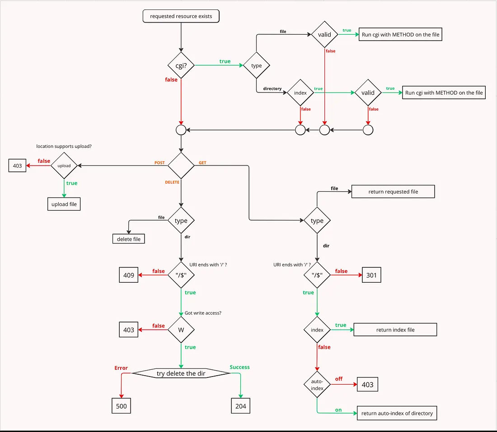

<div align="center">

# WebServ - *Cache Me If You Can*

**Outstanding Project • 125/100 @ 42 Beirut** | *epoll-powered HTTP/1.1 server in C++98*

[](https://en.cppreference.com/w/cpp/98)
[](https://tools.ietf.org/html/rfc2616)
[-FF6B6B?style=for-the-badge)](https://man7.org/linux/man-pages/man7/epoll.7.html)
[]()


*Zero dependencies • Pure C++98 • Production-grade*

</div>

---

## ✨ What We Built

A **fully asynchronous HTTP/1.1 server** that doesn't just work-it *shines*. From the reactor-pattern event loop to the stunning web interface, every detail was crafted with precision.

### 🚀 Quick Start

```bash
# Build the server
make

# Launch it
./webserv conf/default.conf

# Open your browser
http://localhost:8080
```

That's it. Three commands. One beautiful interface.

---

## 🎨 The Experience

We didn't just build a server. We built an **experience**. A modern, interactive web interface with aurora gradients, glassmorphism effects, and real-time testing capabilities.

<div align="center">


_Test all HTTP methods with live console feedback_

</div>

### What Makes It Special

- **🌌 Aurora Background Effects** - Animated gradient meshes that breathe life into the page
- **💎 Glassmorphism UI** - Frosted glass effects with blur and transparency
- **✨ Animated Shimmer Text** - The title and team name glow and shimmer with gradient animations
- **🎯 Real-Time Testing** - Execute HTTP requests and see responses instantly
- **🔥 Interactive Particles** - Mouse-reactive particle system with connection lines
- **📱 Fully Responsive** - Looks stunning on any device

---

## ⚡ Architecture: Where Beauty Meets Performance

<div align="center">


_Event-driven architecture with epoll at its core_

</div>

### The Reactor Pattern in Action

Our event loop is a symphony of **O(1) efficiency**:

1. **epoll_wait()** monitors all file descriptors in a single syscall
2. **ConnectionManager** dispatches events to the right handlers
3. **Handlers** process data without ever blocking
4. **Rinse and repeat** - thousands of connections, zero threads

**Why This Matters:**

- `select()` → O(n) - scans every descriptor
- `poll()` → O(n) - same performance, no limit
- `epoll()` → O(1) - kernel maintains the ready list

We chose speed. We chose epoll.

<div align="center">


_Visual representation of our reactor-based architecture_

</div>

---

## 🎯 Design Patterns: The Five Pillars

<div align="center">


_Strategy, State, Factory, Observer, Reactor_

</div>

### 1. **Strategy Pattern** - HTTP Method Handlers

Every HTTP method is a pluggable strategy. Want to add PATCH? Write one class. Zero changes to the core.

### 2. **State Pattern** - HTTP Parsing

Parsing happens in stages. Each state knows its job. Handles partial reads naturally.

### 3. **Factory Pattern** - Response Generation

All responses flow through one factory. Consistency guaranteed.

### 4. **Observer Pattern** - Event Notifications

Components subscribe to events. Decoupled. Clean. Maintainable.

### 5. **Reactor Pattern** - The Core

The heart of everything. Event detection → dispatch → handle. Never block.

---

## 🔥 CGI: Async All The Way Down

<div align="center">


_Non-blocking CGI execution pipeline_

</div>

Most servers block on CGI. We don't.

**Our CGI pipeline:**

- Fork process (non-blocking)
- Setup pipes (stdin/stdout/stderr)
- Register pipes with epoll
- Stream data asynchronously
- Parse CGI headers
- Clean up gracefully

**The result?** Your server never freezes. Even if a CGI script takes forever.

---

## 🍪 Session Management

<div align="center">


_Cookie-based session flow with server-side storage_

</div>

Stateful HTTP without the complexity:

- UUID-based session IDs
- Automatic cookie injection
- Server-side key-value storage
- Concurrent session support
- Timeout management

---

## 🎮 The Frontend: God-Tier Beauty

We didn't settle for "good enough." We went for **outstanding**.

### Features That Make You Go "Wow"

✨ **Hero Section**

- Massive, shimmer-animated title with glint effects
- Glowing team name with gradient animation
- Diamond separators and animated badges
- Breathing particle system with 100+ interactive nodes
- Multi-layered aurora mesh with floating gradients

🎨 **Visual Effects**

- 4 animated glow spots (gold, amber, rose, violet)
- Film grain noise texture overlay
- Glass morphism on terminal and cards
- Color-blended particle connection lines
- Mouse-reactive particle glow-up effect
- Radial cursor light

🚀 **Interactive Elements**

- Tab-based HTTP method testing
- Real-time console output
- CGI script gallery with one-click execution
- Session/cookie inspector
- Hover animations on all cards
- Smooth scroll reveal animations

---

## 📊 What We Support

| Feature              | Status  | Notes                                               |
| -------------------- | ------  | --------------------------------------------------  |
| **GET**              |  ✅     | Static files, directory listing, CGI, query params |
| **POST**             |  ✅     | Form data, JSON, multipart uploads, CGI input      |
| **PUT**              |  ✅     | Create/update resources, auto-create directories   |
| **DELETE**           |  ✅     | File deletion with safety checks                   |
| **HEAD**             |  ✅     | Metadata without body content                      |
| **Keep-Alive**       |  ✅     | Persistent connections                             |
| **Chunked Encoding** |  ✅     | Transfer-Encoding: chunked                         |
| **Sessions**         |  ✅     | Cookie-based with server storage                   |
| **MIME Types**       |  ✅     | Content negotiation                                |
| **CGI/1.1**          |  ✅     | Python, Shell, any executable                      |
| **Custom Errors**    |  ✅     | Branded 404/500 pages                              |
| **Timeouts**         |  ✅     | Request timeout protection                         |
| **Security**         |  ✅     | Path traversal prevention, size limits             |

---

## 🏗️ Project Structure

```
Webserv/
├── include/             # Headers organized by layer
│   ├── app/             # Request handlers (Strategy pattern)
│   ├── config/          # Configuration parser (Builder)
│   ├── core/            # Event loop, epoll, connection manager (Reactor)
│   ├── http/            # HTTP protocol, parser (State pattern)
│   └── utils/           # MIME types, sessions, logging
├── src/                 # Implementation files (mirrors include/)
├── www/                 # Web root with stunning interface
│   ├── index.html       # God-tier homepage
│   ├── cgi-bin/         # CGI scripts (Python, Shell)
│   └── uploads/         # Upload directory (auto-created)
├── conf/                # NGINX-style configurations
├── images/              # Screenshots and diagrams
└── Makefile             # Build system
```

---

## 🧪 Testing It Out

### Via Browser (Recommended)

```bash
make && ./webserv conf/default.conf
```

Then open **http://localhost:8080** and explore:
- Interactive HTTP method testing
- CGI script gallery
- Session/cookie inspector
- Real-time response console

### Via Command Line

```bash
# GET request
curl http://localhost:8080/

# POST with data
curl -X POST -d "key=value" http://localhost:8080/cgi-bin/post_test.py

# Upload file
curl -X POST -F "file=@myfile.txt" http://localhost:8080/uploads

# PUT resource
curl -X PUT -d "content" http://localhost:8080/uploads/test.txt

# DELETE resource
curl -X DELETE http://localhost:8080/uploads/test.txt

# HEAD metadata
curl -I http://localhost:8080/

# CGI with query
curl "http://localhost:8080/cgi-bin/calculator.py?a=5&b=3&op=add"
```

---

## 🛠️ Makefile Commands

```bash
make          # Build the server
make debug    # Build with verbose logging
make clean    # Remove object files
make fclean   # Full cleanup (includes www/uploads)
make re       # Rebuild from scratch
```

---

## 🎯 Why This Project Stands Out

**Technical Excellence:**
- Reactor pattern with epoll (O(1) performance)
- Five design patterns working in harmony
- Non-blocking I/O throughout the entire stack
- Zero external dependencies (pure C++98)

**Visual Brilliance:**
- Production-quality web interface
- Aurora gradients and glassmorphism
- Interactive particle system
- Animated text effects

**Production Ready:**
- Comprehensive error handling
- Security measures (path traversal, timeouts, size limits)
- NGINX-style configuration
- Full HTTP/1.1 compliance

**The Result:** 
**125/100** - Outstanding Project @ 42 Beirut

---

## 👥 Team

**Cache Me If You Can**

- **Ali Itawi**
- **Mohamad Al Mohamad**
- **Farah El Khatib**

*Built with precision at 42 Beirut*

---

## 🙏 Acknowledgments

- **42 School** for pushing us to build something exceptional
- **epoll** for making asynchronous I/O beautiful
- **NGINX** for configuration inspiration
- **The Gang of Four** for timeless design patterns

---

## 📜 License

Educational project for 42 School curriculum.

---

<div align="center">

**⭐ Outstanding Project ⭐**

*When they said "build a web server," we built a masterpiece.*

</div>
